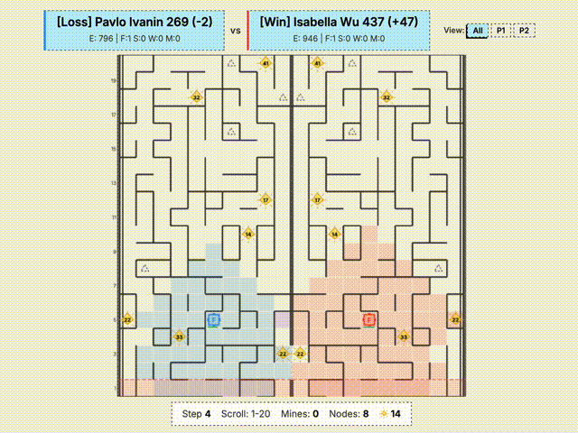
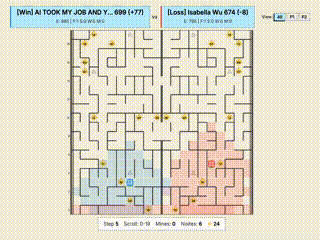
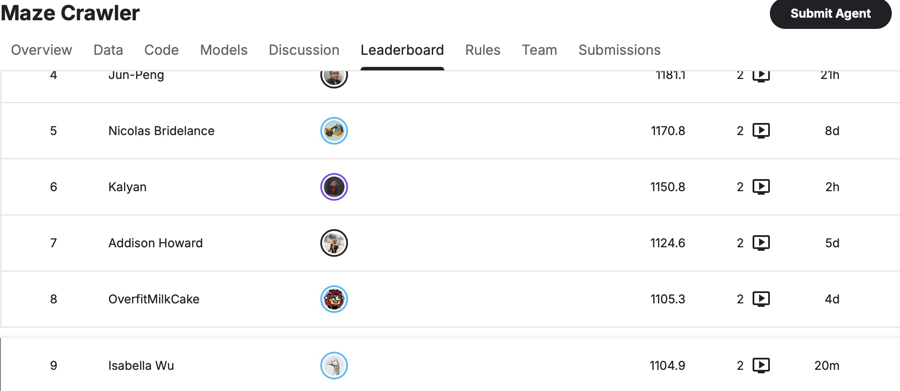
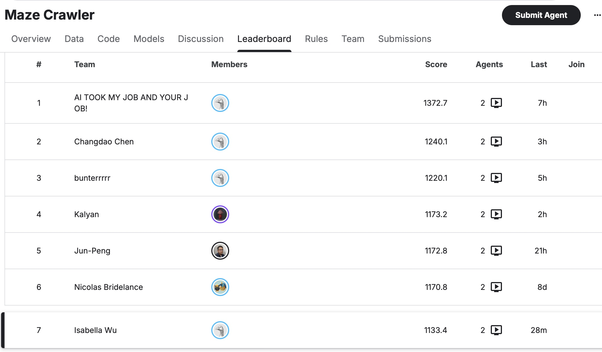
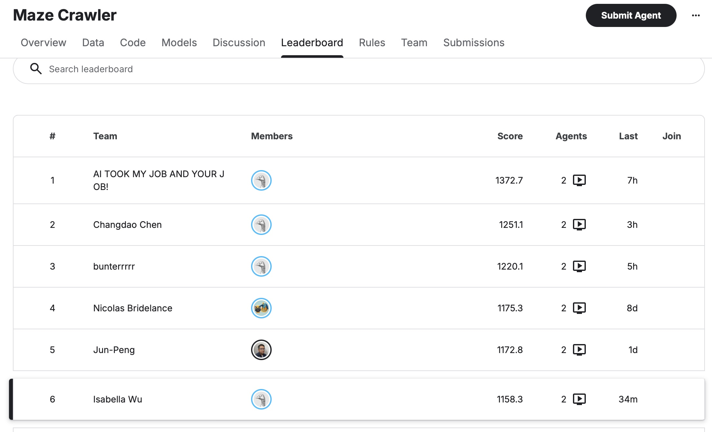
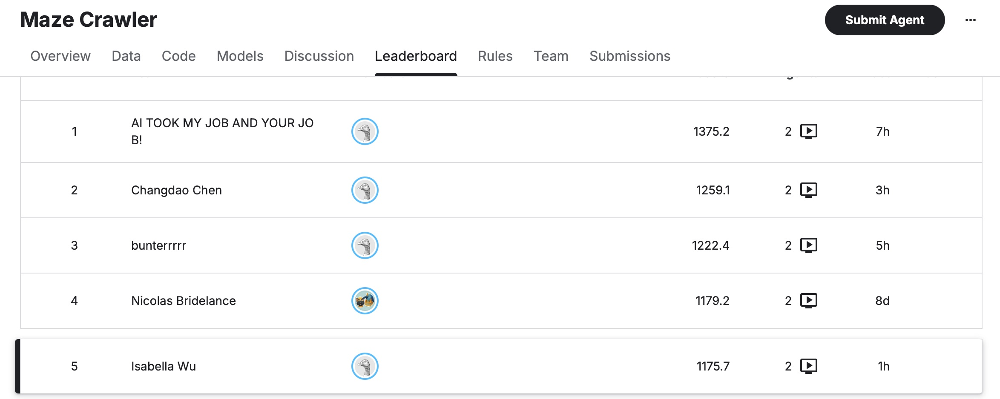
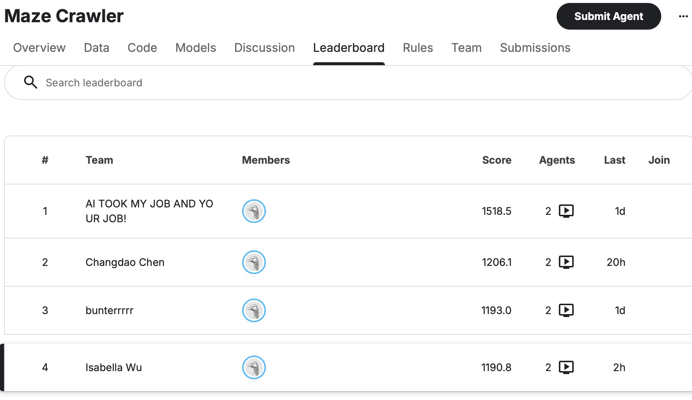

# Maze Crawler Agent

This project is an ongoing attempt to build a competitive agent for Kaggle's Maze Crawler challenge. The core problem is not just moving units through a maze, but making good decisions under fog of war, limited energy, scrolling pressure, and a high penalty for small tactical mistakes. The agent has been built incrementally, starting from simple rule-based movement and growing toward a more structured decision system with search, memory, and role-based coordination.

## Project Goal

The goal of the agent is to survive while still building a meaningful energy economy. In practice, that means balancing several competing objectives at once:

- keep the factory from falling behind the scroll
- explore enough of the maze to find crystals and mining nodes
- turn miners into long-term energy sources when good opportunities appear
- avoid self-destructive friendly collisions
- move units intelligently through partially known terrain

Rather than jumping straight into machine learning, this project focuses on building a strong algorithmic baseline first. That makes the behavior easier to reason about, easier to debug, and much more useful as a foundation for later learning-based improvements.

## Design Approach

The development process has followed a staged strategy.

At the beginning, the agent used simple greedy movement rules: move north when possible, collect nearby resources, and react locally to walls. That was enough to get a legal bot running, but it exposed the main weaknesses of naive policies very quickly. Units looped in corridors, miners got stuck taking locally good but globally bad routes, and scouts often wasted turns because they had no memory of where they had just been.

The next step was to add persistent per-unit memory. Scouts and miners now keep short movement histories so they are less likely to oscillate between the same few cells. This added a lightweight tabu-style behavior without requiring a full global planner for every situation. The reasoning here was simple: in a maze with partial visibility, even a small amount of memory can dramatically improve movement quality.

After that, the agent was upgraded from one-step greedy movement to actual graph search on known terrain. Once enough of the maze has been discovered, units can use queue-based `BFS` routing to move around walls instead of repeatedly making short-sighted choices. This was an important shift in the project: movement stopped being purely reactive and became more plan-driven.

## Current Agent Logic

The current bot uses a role-based control system.

- The factory acts as the strategic anchor. It decides when to move north for survival, when to jump, and when to spend energy on scouts, workers, or miners.
- Scouts are used for fast exploration and crystal gathering. When they accumulate enough energy, they prioritize returning to the factory so that value is not stranded in fragile units.
- Workers are utility units. Their main job is to reduce movement bottlenecks, especially when the factory is blocked by a wall and needs help progressing.
- Miners are the long-term economy play. They try to reach mining nodes efficiently and convert into mines when the position is worth committing to.

This division of labor keeps the policy understandable while still allowing different unit types to serve different strategic purposes.

## Algorithms and Heuristics

The current implementation is built around a few practical algorithmic ideas:

- `BFS` pathfinding with a `deque` frontier for routing through discovered sections of the maze
- visited-state pruning with sets so robots do not repeatedly expand the same `(col, row)` or `(col, row, jump_cd)` state
- shortest-path search on an unweighted grid graph, where cells are vertices and legal moves are edges
- Manhattan-distance scoring for choosing crystals, mining nodes, frontier cells, and other local targets efficiently
- greedy target selection for choosing nearby crystals, frontier cells, and mining nodes
- tabu-style recent-cell memory to reduce loops when the map is incomplete
- collision avoidance heuristics to reduce friendly fire and wasted turns
- role-based action policies so each robot type contributes differently to the overall plan

What I liked about this part of the build is that it felt very close to the kinds of ideas taught in a data structures class. The maze can be modeled as a graph, the search frontier can be stored in a queue, and each expansion step asks the same core question: what is the next reachable state that moves this robot closer to a useful goal without revisiting already-explored states? On top of that, Manhattan distance works as a lightweight heuristic for ranking targets before committing to a full search, which makes the bot feel like a practical mix of exact graph traversal and cheaper local estimation.

In practice, the bot now uses several `BFS`-style helper functions for slightly different jobs. Some searches are simple move-only shortest-path checks, while others treat jump cooldown as part of the state and explore tuples like `(col, row, jump_cd)`. That is a very `CSCI 104` kind of idea: once the rules get more complicated, the state space itself has to become richer.

This combination was chosen because the environment mixes long-term planning with incomplete information. Pure graph search is not enough when the world is only partially visible, and pure greedy movement is not enough once the maze becomes more complex. The current design tries to use `BFS` where shortest-path structure is reliable and heuristics where the information is still uncertain.

## Thought Process Behind the Build

The main philosophy behind this project has been to solve the most damaging failure modes first.

First, the agent needed to become safe: legal movement, no walking off the board, and better handling of scroll pressure. Next, it needed to become less wasteful: fewer friendly collisions, fewer oscillations, and better use of unit roles. Only after that did it make sense to invest in better routing with search.

That order matters. There is not much value in adding sophisticated pathfinding to a bot that still loses games because it accidentally trades away energy, gets trapped in short loops, or fails basic survival checks. Each layer of improvement has been added to make the next layer more useful.

## Why This Project Matters

This project is a good example of applied algorithmic decision-making under uncertainty. It combines elements of pathfinding, multi-agent coordination, resource management, and partial-observability reasoning in a way that is concrete and testable. It also creates a strong baseline for future extensions such as:

- broader map memory and exploration policies
- better assignment of scouts across multiple resource targets
- deeper search for tactical engagements
- simulation-based planning
- reinforcement learning or imitation learning on top of the current heuristic framework

## USC Coursework Connection

This project also reflects ideas from USC's `CSCI 103` and `CSCI 104`. The implementation relies on the programming discipline, modular design, and debugging practices emphasized in `CSCI 103`, while many of the agent's decision-making systems were directly inspired by concepts from `CSCI 104`.

One especially direct connection is the search material from `CSCI 104`, including the [Rush Hour homework](https://bytes.usc.edu/cs104/homework/hw3/#problem-5---rush-hour-40). Building the bot became a practical way to apply data structures and algorithms in a dynamic environment rather than only through isolated homework problems. Concepts such as graphs, `BFS`, `DFS`, queues, shortest-path search, heuristic-driven decision making, state expansion, visited-set pruning, and algorithmic tradeoffs became much more tangible once they directly affected how units behaved inside the maze.

For example:

- `DFS`-style exploration ideas influenced how scouts reason about partially discovered terrain and frontier expansion
- `BFS` is used as the main shortest-path tool because the maze movement graph is unweighted, which makes queue-based search a natural fit
- the bot's search helpers use a `deque` frontier and `set`-based visited tracking, exactly the kind of queue-and-hash-set pattern emphasized in data structures coursework
- Manhattan distance is used as a simple heuristic metric for target ranking, which is the kind of grid-based optimization idea that comes up naturally once shortest-path search meets limited compute
- jump-aware routing treats cooldown as part of the state, so the search space is not just position but position plus future mobility
- heuristic evaluation helps balance exploration, survival, and resource collection under uncertainty
- persistent unit memory functions similarly to lightweight tabu-search behavior by discouraging repetitive movement loops
- role-based coordination mirrors the kind of systems-level decomposition emphasized in algorithmic design

Working on the project also reinforced an important lesson from `CSCI 104`: an algorithm is not just about correctness, but also about tradeoffs between efficiency, flexibility, memory, and behavior under imperfect conditions. `BFS` may be theoretically simple, but in this project the hard part was deciding what the nodes and edges should mean, what belongs in the state, when to stop the search, and when a cheaper heuristic is actually the better engineering choice. In that sense, the bot became more than a Kaggle competition entry. It became a larger systems-style application of core computer science concepts to real-time decision making under uncertainty.

## Progress Update

### 1. Search and Stability

One of the first really encouraging moments in this project was seeing the bot move from roughly the `400+` range to the `670+` range on the competition ladder. That jump did not mean the agent was suddenly "done," but it was the first strong sign that the underlying direction was getting better. The bot was still simple in a lot of ways, but it was starting to make fewer obviously bad decisions.

The improvement seems to come from a few specific changes working together:

- replacing mostly local greedy movement with more deliberate search-based planning
- improving factory survival through better northward routing and jump-aware navigation
- reducing friendly interference through destination reservation and cleaner unit coordination
- using maze symmetry to make better movement decisions before the full map is visible
- preserving economically useful information such as mining-node locations instead of repeatedly rediscovering them

In practical terms, the newer versions seemed to lose fewer games to avoidable mistakes. Earlier versions often wasted turns in loops, took weak local routes, or failed to turn partial map knowledge into better movement decisions. Once those problems were reduced, the whole bot started feeling less random. That matters a lot in a ladder setting, because sometimes avoiding one bad loss is worth more than finding one flashy win.

This update also reinforced a useful lesson for the project as a whole: performance gains did not come from one isolated trick, but from tightening the system end to end. Better search, better state management, and better coordination each contributed a little, and together they produced a noticeably stronger bot.

### 2. Factory Danger Mode

A lot of the next improvement did not come from adding some fancy new algorithm. It came from sitting down with losing replays and noticing that the factory was still making the wrong choices once the scroll got close. The bot could keep spending energy on support behavior, drift sideways or backward, and even spawn units at exactly the moment when survival should have been the only thing that mattered.

To address that, the agent was updated with a more explicit factory danger mode. When the factory gets too close to the southern boundary, normal convoy logic is temporarily overridden. In that state, the bot stops feeding workers, stops spawning new units, and switches into a survival-only routing mode focused on moving `NORTH`, `EAST`, or `WEST` without allowing low-value detours. Jump logic also remains available as an emergency escape tool.

This change mattered because those losses were not always caused by pathfinding in the abstract. Sometimes the bot already knew enough to survive, but its priorities were simply wrong. The factory was still acting like a coordinator when it really needed to act like the one unit that everything else should revolve around.

More broadly, this was a useful reminder that strong competition bots are often improved less by adding complexity and more by removing bad behavior in the highest-risk states. In this case, the replay showed that late-game survival logic needed to be stricter, and tightening that rule set was likely more valuable than adding another economic or exploration feature.

### 3. Energy Reserve Fix

The next lesson was a different kind of failure entirely. The factory was not dying because it was trapped too low on the board. It was dying because it was slowly bankrupting itself. In one episode, the factory stayed alive and looked fine positionally for a long time, but by roughly turn `191` it had reached `0` energy. From then on, it was basically a dead object waiting for the scroll to finish the job.

This loss showed that the problem was not mainly pathfinding. It was an economic collapse caused by overspending on workers and then transferring too much energy into them. The factory was behaving like an unlimited battery for its support units even when preserving its own energy reserve should have been the higher priority.

To address that, the agent was updated with stricter factory energy reserve rules. Worker, scout, and miner production now require larger minimum energy buffers, and factory-to-worker transfers are only allowed when the factory is both safe and meaningfully rich. In other words, the bot now treats factory energy as a protected survival resource rather than something that can always be spent on support behavior.

This update also coincided with another meaningful ladder improvement, with the bot moving from roughly the `670+` range into the `730+` range. As with the earlier score jump, that increase should not be read as proof that the agent is finished, but it does suggest that protecting factory energy made the policy more stable over long games and reduced another major source of avoidable losses.

This change reinforced another important lesson from the project: a bot can still lose even when it survives physically if it stops functioning economically. The replay made it clear that long-term survival depends not just on staying ahead of the scroll, but also on protecting enough factory energy to remain an active decision-maker deep into the game.

### 4. Early Mine Economy Response

One of the clearest strategic wake-up calls came from losing to a bot named `AI TOOK MY JOB AND YOUR JOB!`. That match showed that even if the convoy logic was relatively stable, the agent could still lose badly to an opponent that got an early mine economy running and then snowballed factory energy from there.

In that match, the opponent transformed a miner into a mine very early and used that long-term income source to outscale the convoy-based strategy. Their factory energy kept compounding while the bot continued investing mostly in workers and survival structure. The result was not a sudden tactical collapse, but a slower strategic defeat caused by being economically outclassed.

To address that, the miner policy was updated to respond more aggressively when known mining nodes are nearby and realistically reachable. The bot still treats factory survival as the top priority, but it is now more willing to open an early miner line when the opportunity is strong enough to matter. The goal of this change was not to abandon the safer convoy architecture, but to prevent obviously favorable mine opportunities from being ignored while an opponent scales uncontested.

This update reinforced a broader systems insight: a stable bot can still be strategically incomplete if it survives well but never develops a meaningful answer to compounding income. In other words, safety and economy are not competing ideas in this environment; a competitive agent eventually needs both.

### 5. Lean No-Mine Production

After the earlier survival and energy fixes, a new late-game pattern started showing up pretty clearly. The bot could still make poor production decisions in long tiebreak-heavy games. In one replay, the factory even survived all the way to the step-500 tiebreaker, but the agent still lost because it spent too much of its economy on extra workers and a scout without ever turning that spending into a mine or a real long-term advantage.

The replay made the problem clear: the early mine-response logic was not actually the reason for the loss, because no miner was built and no mine was created. Instead, the bot kept expanding its support structure in a game where there was no concrete mine opportunity on the board. The result was a bloated convoy, lower factory reserves, and a much weaker total-energy position by the end of the match.

To address that, the production policy was tightened again. When there are no known open mining nodes, the factory now treats that as a signal to play much leaner. In those games, worker count is capped more aggressively, scouts are delayed behind a higher energy threshold, and larger unit production is reserved for situations where there is either a real mining plan or a stronger strategic reason to spend.

This was an important adjustment because it sharpened the distinction between two different game states. If a promising mining node exists, the bot should be willing to invest. If no such opportunity exists, then preserving factory energy for movement, survival, and the final tiebreak is often the better strategy. In that sense, this update was less about adding a new feature and more about teaching the bot when not to overbuild.

This round of production tightening also led to the strongest leaderboard jump so far, pushing the agent into the top `10` of the competition and reaching roughly the `1100+` range. That result was especially encouraging because it came not from adding a flashy new mechanic, but from making the bot more disciplined about when not to spend. In a long-horizon environment like Maze Crawler, that kind of restraint turned out to be just as important as pathfinding or exploration.

### 6. Scout Production Clamp

By this point in the competition, one production leak stood out almost immediately: the bot could keep spawning replacement scouts even when the earlier scouts had already transferred their energy, dropped to `0`, and become basically useless. They were not creating meaningful value anymore, but they were still costing build energy and weakening the late-game factory economy.

To address that, scout production was tightened much more aggressively. The factory now treats scouts as a high-quality luxury rather than a default exploration tool. In practice, that means scouts are no longer built in no-mine games, new scouts are blocked while stranded zero-energy scouts are still on the board, and even valid scout production requires a richer factory state and a larger safety buffer from the scroll.

This change reinforced a theme that kept appearing throughout the project: better performance often came from removing low-value behavior rather than adding more complexity. In this case, cutting speculative scout production helped preserve factory energy for the situations that actually decide games, especially long tiebreak-heavy matches where the final energy total matters just as much as surviving the maze itself.

### 7. Miner Commitment Filter

This update also came with another nice leaderboard bump. After tightening miner commitment, the bot moved up from the earlier top `10` range into rank `7`, with the score climbing to roughly `1133.4`. That was a useful sign that being more selective about when to start a miner plan was not just theoretically cleaner, but actually helping the agent convert decisions into more stable ladder performance.

The mining logic had a subtler problem too. The bot could correctly recognize that mining was strategically important, but still commit to the wrong miner at the wrong time. In one loss, a second miner was built off weak information, never successfully transformed into a mine, and ended up behaving more like a `300`-energy sink than a long-term investment.

That failure highlighted an important distinction between noticing a possible mining opportunity and having enough evidence to justify spending on it. A remembered node somewhere on the map was not always enough. If the path was uncertain, the scroll was already tightening, or a first mine was already established, then opening another miner line could be more harmful than helpful.

To address that, miner production was made much more selective. Early miner builds now require a nearby visible mining node rather than only remembered information, the factory must have a healthier energy cushion before committing, and speculative follow-up miners are blocked once a friendly mine already exists. The bot can still invest in mining, but it now needs a clearer signal that the investment is likely to convert into real long-term value.

This update reinforced one of the core lessons of the project: good economic strategy is not just about recognizing what could be valuable, but also about filtering out opportunities that are too uncertain to justify the cost. In practice, that made the bot more disciplined about when to pursue mining and when to keep the factory economy intact.

### 8. Miner Abort Logic

This change also lined up with another small but encouraging leaderboard step forward. After improving miner abort behavior, the bot moved up again from rank `7` to rank `6`, with the score reaching about `1158.3`. That was a nice confirmation that it was not enough for the agent to recognize mining opportunities; it also needed to know when to cut a bad mining plan short before the factory paid too much for it.

Even after tightening when miners could be built, it became clear that better miner production rules were still not enough on their own. A miner that failed to reach a real node could still sit on the board as an expensive, low-value unit while the factory economy weakened around it. In other words, the bot was getting a little better at deciding when to start a miner plan, but not yet good enough at deciding when to give up on one.

To address that, the miner policy was extended with explicit abort logic. Miners now evaluate whether a node plan is still credible based on distance, scroll pressure, and available energy. If the answer is no, they stop behaving like long-term mining investments and instead try to salvage value by returning toward the factory. When possible, that means transferring their energy back into the factory rather than wandering until they are eventually lost to the scroll.

This update mattered because it closed an important gap in the bot’s decision-making. A good strategy is not only about choosing when to commit, but also about recognizing when a commitment has failed and recovering as much value as possible. In that sense, the miner abort logic was less about mining itself and more about making the agent better at cutting losses before they become game-deciding ones.

### 9. Factory Trade Filter

A completely different kind of mistake showed up in the late-game factory routing. Sometimes the bot would choose a move that looked tactically reasonable in the moment, but actually led straight into a mutual factory collision that favored the opponent on the tiebreak. In the replay that exposed this, both factories died on the same turn, but the opponent still had one extra surviving unit. So the collision was not neutral at all. It was basically a losing trade dressed up as a dramatic ending.

To address that, the factory decision layer was updated with a factory-trade filter. The bot now estimates the cells the enemy factory could also occupy on the next turn and compares the surviving non-factory unit counts on both sides. If the opponent has the tiebreak advantage, the factory becomes much more cautious about taking moves or jumps that would allow a mutual collision. When possible, it reroutes to a safer path instead of accepting what is effectively a losing exchange.

This change reinforced another important principle from the project: tactical survival is not just about staying alive one more turn, but also about understanding what kind of endgame a move is creating. A factory trade can be fine when the tiebreak is favorable, but it becomes a blunder when the opponent is the side that benefits from both factories disappearing.

### 10. Stale Miner Recovery

This update also matched another step up on the leaderboard. After adding stale miner recovery, the bot climbed from rank `6` to rank `5`, with the score reaching about `1175.7`. That felt like a good confirmation that tracking whether miners were actually making progress, instead of just assuming they were still useful, was improving the bot in a very practical way.

As the competition went on, it became clear that even with stricter miner production and abort rules, a miner could still fail in a quieter way. It might never transform, never return its energy, and still sit in roughly the same area long enough to become a slow economic drain on the factory. In those cases, the bot was technically "aware" that the miner plan was getting worse, but it was still reacting too late to actually save the value.

To address that, the miner logic was extended with lightweight persistent memory. Miners now keep track of whether they are actually making positional progress over time. If a miner remains effectively stuck for too many turns without converting into a mine, that state is treated as a failed investment rather than a normal temporary delay. The miner then shifts into a more aggressive recovery mode, preferring to route back toward the factory and salvage its energy instead of continuing to behave like a long-term mining attempt.

This update matters because it adds an additional layer of realism to the bot’s economic reasoning. A strong strategy is not only about identifying good opportunities and abandoning obviously bad ones; it is also about recognizing when a plan has become quietly unproductive before the factory pays too high a price for waiting. In that sense, stale miner recovery made the bot better at treating time itself as part of the cost of a commitment.

### 11. Prospecting Scout and Energy Return

As stronger opponents started showing more reliable mine economies, it became pretty obvious that the bot was sometimes losing before any miner decision even happened. In those games, the real problem was informational and structural. Without an early way to discover promising nodes, the bot could stay blind for too long, miss the best mining opportunities, and fall behind against agents that were better at turning early map knowledge into long-term energy growth.

To address that, the agent was updated with a more deliberate prospecting layer. In strong no-mine openings, the factory can now allow a single early scout whose job is not just generic exploration, but specifically to help expose meaningful opportunities the rest of the economy can act on. At the same time, worker behavior was adjusted so that accumulated energy is more likely to be transferred back into the factory instead of remaining stranded in support units that are no longer central to the game plan.

This change mattered because it connected information gathering and energy management more directly. A mine economy is not only about building miners at the right moment; it also depends on seeing those moments early enough and making sure intermediate units return value rather than merely consuming it. In that sense, the prospecting scout and energy-return update helped the bot move a little closer to the kind of information-to-economy loop that stronger leaderboard agents were already using effectively.

### 12. Mine Harvestability Filter

As the bot got better at actually reaching and transforming mining nodes, another weakness surfaced: not every successful mine was really a good mine. In several games, the agent created mines that looked great on paper because they filled up with energy, but in practice that value was stranded too far behind the live part of the game. The factory never turned that stored energy into a meaningful late-game advantage before the scroll removed the chance.

To address that, mine creation was made more selective and more tightly connected to collection behavior. The bot now treats a mine as worthwhile only when there is a realistic plan to harvest it with the factory or nearby support units before it turns into dead storage. Workers and scouts were also updated to recognize rich friendly mines as active energy targets, so that filled mines are more likely to be cashed out instead of simply admired from a distance.

This update mattered because it sharpened the difference between nominal value and usable value. A full mine is only an advantage if the bot can actually turn that stored energy back into factory survival or future production. By filtering out low-harvest mines and improving follow-through on rich ones, the agent moved closer to a more complete mine-to-factory economy loop.

### 13. Build Pressure Control

One of the nicest surprises in the project came from this round of production tuning. After tightening build pressure control, the bot moved up from rank `5` to rank `4`, with the score reaching about `1190.8`. That was especially satisfying because it showed that being more disciplined about when to stop building could matter just as much as adding new movement or mining logic.

As the competition continued, another pattern became hard to ignore. Even when parts of the economy were working, the factory could still keep producing support units after the board was already cluttered with stranded or low-value pieces. In those games, the issue was not always the first build decision. It was the cumulative pressure of continuing to spend after earlier units had already stopped contributing enough to justify more production.

To address that, the factory production rules were tightened around board state rather than only raw energy thresholds. The bot now pays more attention to whether existing workers and scouts are still active, whether too many stranded support units are already on the board, and whether mine value is already present and should be protected instead of diluted by further spawning. In practice, that means production slows down much more aggressively once the support layer starts looking like deadweight.

This update mattered because it moved the bot closer to a more disciplined economy. A strong agent does not just need good unit logic; it also needs to know when to stop adding new pieces and preserve the value it has already created. Build pressure control was meant to make the factory less eager to turn a temporary advantage into a slow late-game liability.

### 14. Opening Lane Safety and Scout Follow-Through

As the competition kept going, one of the stranger replay bugs came from the opening itself. In one game, the bot actually made the "right" high-level choice by trying to start a miner line earlier, but then immediately undercut itself by stepping the factory into its own freshly spawned unit. In another set of games, the opening would still slide too easily into a worker-only pattern, which made it much harder to discover or commit to a useful early mine before stronger opponents had already pulled ahead.

To address that, the opening logic was tightened in two ways. First, the factory now treats friendly support positions as real hazards and avoids moving or jumping into its own freshly spawned units whenever possible. Second, the opening build order became more flexible: a single early worker no longer blocks the bot from following up with a scout, and a scout-discovered node can now trigger a miner line more directly instead of forcing the whole economy through a worker-first sequence.

This update mattered because it improved the part of the game where small mistakes are disproportionately expensive. Burning `300` energy on a self-crushed miner or drifting into a passive worker-only opening can decide the rest of the match before the midgame even starts. In that sense, this pass was about making the opening less brittle and more capable of turning early information into an actual economy plan.

### 15. Late Miner Restraint and Better Endgame Cashout

Another set of replays showed a different pattern: the bot could eventually create a strong mine, but only after the factory had already fallen too far behind on position for that late economy to really matter. In those games, the agent was sometimes too patient with opening miners that stalled near the starting area, and too willing to open fresh miner lines late even when the scroll pressure meant the payoff would come after the most important movement race had already been lost.

To address that, the miner policy was tightened again. Opening miners now give up sooner if they stall near the spawn area without finding a credible nearby node, and late miner builds require a much stronger combination of factory energy and positional safety before the bot will commit. The factory was also updated to treat rich harvestable mines as something to actively cash out in poor-energy states, and the factory-trade filter now remembers the enemy factory's last seen position so it can avoid some bad blind trades even under fog of war.

This update mattered because it tied the economy logic more closely to timing. A mine is not automatically good just because it exists; it has to arrive early enough, be harvested strongly enough, and still leave the factory in a position where the extra energy can influence the endgame. That made this pass less about "more mining" and more about learning when mining is already too late to be the right answer.

### 16. What I Learned From The Failure Folder

After a while without updating the code, I could feel the bot slipping out of the top `10`, and that pushed me to read through the `failure/` folder much more seriously. What stood out pretty quickly was that the same three problems kept repeating across a lot of losses. First, miner plans were failing too often, either because miners never transformed or because they stalled for too long before doing anything useful. Second, even when the bot survived for a while, it was frequently falling behind economically because too much energy was tied up in weak support lines or slow mining ideas. Third, several losses were not immediate survival mistakes at all, but endgames where the bot reached the finish line in a weaker tiebreak position than it should have.

That changed the way I thought about the next round of fixes. Instead of treating each replay like a totally separate story, I started treating them as evidence for a few repeated structural weaknesses. In first person, the lesson for me was pretty simple: I did not need a more complicated bot nearly as much as I needed a bot that gave up on bad miner lines sooner, spent less freely on support units, and converted good mine opportunities into live factory strength earlier.

Based on that, I tightened the opening miner logic again, made stalled miners abort faster when they were still hanging around near the spawn area, and reduced how easily the bot could drift into extra workers without a strong reason. I also kept pushing the factory logic toward better mine cashout behavior and safer endgame decisions, because the failure set made it clear that "having value somewhere on the board" is not the same thing as having a position that actually wins.

What I learned most from this pass is that the bot loses less from one dramatic bug than from repeated small inefficiencies that stack up over a long game. Reading the failure folder all at once made that much more obvious. It pushed me to think less in terms of isolated features and more in terms of repeated failure patterns, which ended up being a much better guide for deciding what to improve next.

### 17. Reading The New Failure Batch

After updating my agent, the situation didn't get better, but in a way that felt even more concrete. The most common pattern was still falling behind economically. Right behind that were miner lines that never really paid off and games where I had simply spent too much on workers for too little return. Seeing those patterns repeated across multiple opponents made it much harder to pretend they were just isolated bad luck or one-off matchup problems.

What I took from that was that the bot still needed to be more disciplined about what kind of economy line it was starting. I did not just need a bot that could sometimes build a miner or sometimes survive for a long time. I needed a bot that was less likely to drift into a weak middle ground where it spent on miners that stalled, spent on workers that did not materially help, and then arrived at the late game both poorer and less flexible than the opponent.

Based on that batch of failures, I tightened the rules around worker production again, especially in openings where workers did not have a very clear job. I also made miner commitment more one-line-at-a-time by using stricter total unit checks, so the bot is less likely to reopen the same weak economy pattern again and again. The overall goal of that pass was to make the bot choose fewer but cleaner commitments rather than sprinkling energy across multiple ideas that never fully develop.

What I learned from this round is that losing games in Crawl often looks dramatic at the end, but the real mistake usually happens much earlier in the spending pattern. Reading a whole batch of failures together made that easier to see. It reminded me that the best fix is often not a flashy new mechanic, but a tighter rule about when not to spend in the first place.

## Current Status

The agent is functional and has moved beyond the starter-policy stage. It now includes persistent unit memory, safer movement rules, A*-based path planning on discovered terrain, and differentiated behavior across scouts, workers, miners, and the factory. The project is still in progress, with the next major focus being stronger local evaluation through simulation and more robust strategic tuning.

## Copyright

Copyright (c) 2026 `wuisabel-gif`. All rights reserved.
